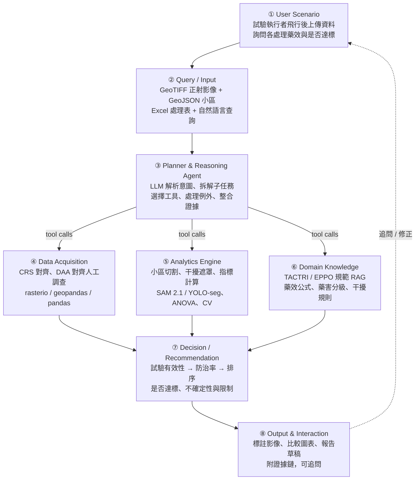
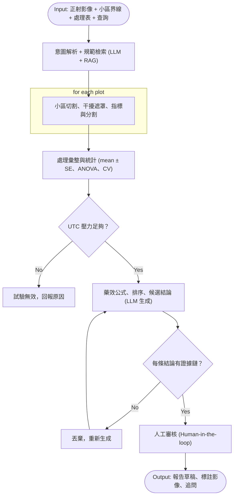

# 5. Proposed Scheme / Proposed Design

### 5.1 System Architecture

> **核心設計原則**：LLM 擔任 planner，感知與計算交給確定性工具。



#### 各模組說明

| 模組 | 內容 | 技術選型（初步） |
| :--- | :--- | :--- |
| **① User/Application Scenario** | 試驗執行者在飛行後上傳正射影像與試驗設計，詢問「各處理對縱捲葉蟲的防治效果如何？是否達登記標準？」 | Web UI (Streamlit / Gradio) 或 CLI |
| **② Query/Input** | 自然語言查詢 + GeoTIFF 正射影像（RGB/多光譜）+ GeoJSON 小區界線 + Excel 處理表與人工調查資料 | rasterio、geopandas、openpyxl |
| **③ Planner & Reasoning Agent** | 解析意圖、辨識試驗類型（除草/殺蟲/殺菌）、拆解子任務、選擇工具、處理例外（UTC 壓力不足、CV 過高） | LLM (Claude / GPT / 本地 Qwen2.5-VL), LangGraph 或 Claude Agent SDK, function calling |
| **④ Data Acquisition / Retrieval** | 讀取影像與向量檔、對齊 CRS、以 DAA 對齊人工調查；向知識庫檢索規範條文 | rasterio / GDAL、pandas；Vector DB (Chroma / FAISS) |
| **⑤ Analytics Engine** | 小區切割與校正（外緣 buffer）、干擾遮罩（青苔/陰影/水面）、指標計算（ExG、VARI、NDRE、brightness）、分割（SAM 2.1 zero-shot $\rightarrow$ YOLO-seg 微調）、模板比對計數、統計（ANOVA / Tukey / CV） | OpenCV、NumPy、scikit-image、Ultralytics、SAM 2.1、statsmodels |
| **⑥ Domain Knowledge Integration** | 規範知識庫：TACTRI 田間試驗準則、EPPO PP 1/152(4)、藥效公式（Abbott、Henderson-Tilton、防治率）、藥害分級、作物生育期、干擾排除規則 | RAG（Markdown / PDF chunk $\rightarrow$ embedding）；規則以 Python 函式確定性執行 |
| **⑦ Decision / Recommendation** | 試驗有效性判定 $\rightarrow$ 各處理防治率與排序 $\rightarrow$ 是否達標 $\rightarrow$ 不確定性與限制說明 | LLM 整合 + 固定模板；證據鏈（ROI、數值、公式、條文） |
| **⑧ Output & Interaction** | 小區級標註影像、處理比較圖表、報告草稿（Markdown / DOCX）、可追問（「為何 T5 排第二？」） | matplotlib / folium、python-docx；對話式追問 |

---

### 5.2 Flowchart

> **對照組壓力不足或缺少證據鏈，流程就停下來。**



* **兩個決策點**：對應 Pseudocode 第 13 行（UTC 壓力）與第 21 行（證據鏈驗證）。
* **人工審核**：在輸出前保留 Human-in-the-loop，符合登記試驗的責任歸屬。

---

### 5.3 Pseudocode

```python
Algorithm 1: 無人機田間試驗評估智慧代理人
Input:  User query Q, orthomosaic I (GeoTIFF), plot boundaries P (GeoJSON),
        trial design D (treatments, blocks, DAA), optional ground truth G
Output: Efficacy assessment report R with evidence chain E

01: Receive Q, I, P, D, (G)
02: intent = LLM.parse_intent(Q)                // target: weed | insect | disease; metric asked
03: type = D.trial_type; design = D.layout      // e.g., RCBD, 8 trt × 3 rep
04: rules = KB.retrieve(type, intent)           // TACTRI/EPPO clauses, efficacy formula, CV threshold
05: I, P = align_crs(I, P); check GSD <= 1 cm else warn

06: for each plot p in P:
07:     tile_p = rectify(I, p, buffer = 1 m)
08:     mask_p = interference_mask(tile_p)      // algae/shadow/water; NDRE cross-check if available
09:     seg_p  = segment(tile_p, mask_p, intent)// SAM 2.1 zero-shot -> YOLO-seg if trained
10:     f_p    = features(tile_p, seg_p)        // coverage %, ExG, VARI, NDRE, count, damage ratio
11: end for

12: F = aggregate(f_p by D.treatment, D.block)  // mean ± SE per treatment; block effect
13: if F[UTC].pressure < rules.min_pressure then
14:     return R = "Trial invalid: insufficient pressure in UTC", E
15: end if

16: eff = rules.formula(F, UTC)                 // Abbott / Henderson-Tilton / control %
17: stats = ANOVA(F); posthoc = Tukey(F); cv = CV(F)
18: if cv > rules.max_cv then flag "high variability"
19: if G exists then corr = correlate(F, G by plot, DAA) // r, p, Kendall tau
20: rank = order treatments by eff with posthoc letters

21: cand = LLM.generate_candidates(rank, stats, rules)   // conclusions per treatment
22: for each c in cand: verify(c, E)                     // every claim must cite ROI / value / clause
23: unc = uncertainty(single DAA, mask coverage, segmentation confidence, cv)
24: R = LLM.compose_report(cand, unc, rules.report_template)
25: present(R, annotated_map(I, P, F), charts, E)
26: return R
```

#### 設計重點
* **第 02, 21, 24 行**：是 LLM 的工作（理解、整合、表達）；第 05–20 行全部是確定性工具，LLM 不得自行估算數值。
* **第 13–14 行**：把「對照組決定一切」的思維寫進流程：UTC 壓力不足即停止。
* **第 22 行**：幻覺攔截機制：沒有證據鏈的候選結論會被直接丟棄。
* **第 19 行**：只有在有人工調查資料時執行；proposal 階段以 4RL 的捲葉率作 ground truth。

---

### 5.4 Technical Feasibility

| 項目 | 現況 | 風險 / 對策 |
| :--- | :--- | :--- |
| **資料** | 4RL、Concil、FHB 正射影像與 ground truth 已在手（$\text{GSD } 0.85 \sim 0.9\text{ cm}$） | 資料來源為公司試驗，需去識別化後放 GitHub；或只公開小區級指標 |
| **影像方法** | 小區切割、模板比對、ExG-brightness、ROI 排除已驗證（育苗箱計數 233 vs. 人工） | 捲葉/白穗在 RGB 的可辨識度未知 $\rightarrow$ 先以 42 DAA 影像做可行性評估 |
| **分割模型** | SAM 2.1 zero-shot 可立即使用；YOLO-seg 需標註 | 標註量控制在 24 小區 $\times$ 2 時點，以 SAM 預標註加速 |
| **LLM / Agent** | 本地 RTX 3060 12 GB 可跑 Qwen2.5-VL 7B / 8B；雲端 API 作對照 | 本地模型推理能力不足 $\rightarrow$ planner 用 API，工具保持本地運行 |
| **統計** | statsmodels ANOVA / Tukey 成熟 | 3 重複檢定力低 $\rightarrow$ 報告中明示限制與不確定性 |
| **時程** | 10 月 proposal $\rightarrow$ 11 月工具鏈 $\rightarrow$ 12 月 agent 整合與實驗 $\rightarrow$ 1 月 handover | 兩人分工明確（見第 6 節） |
